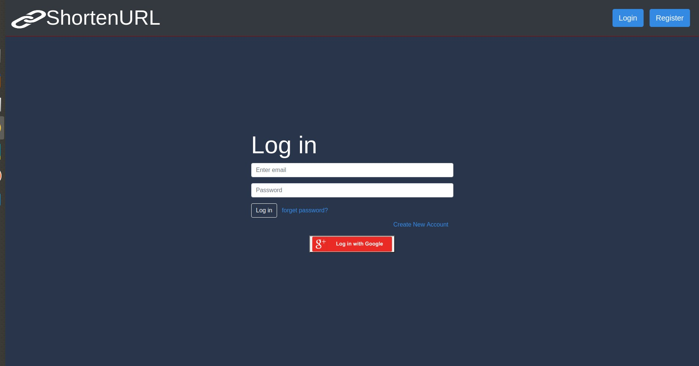
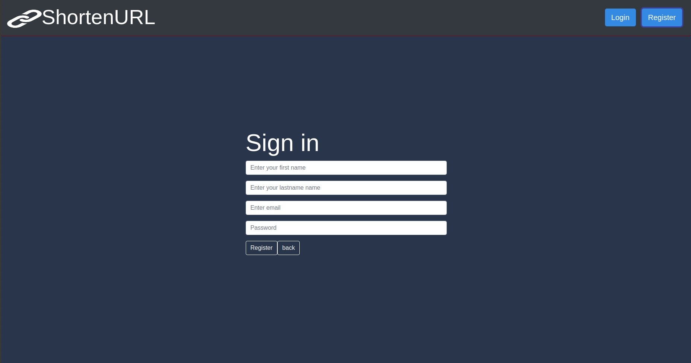
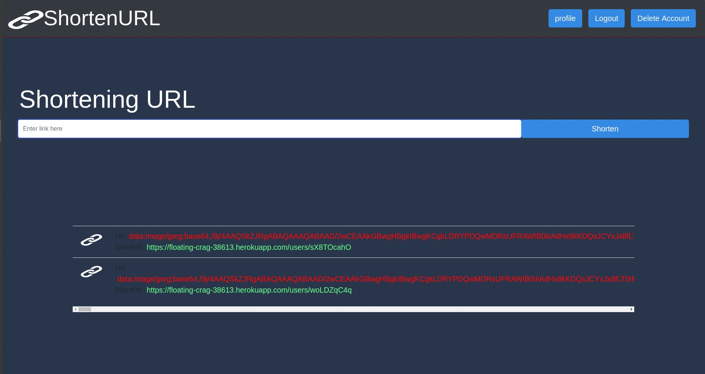
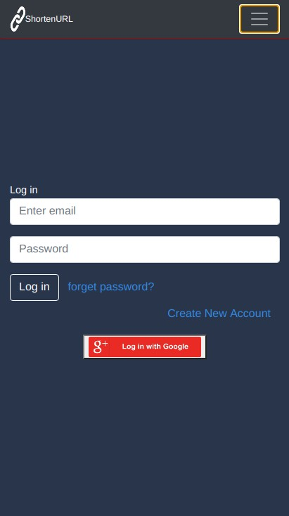
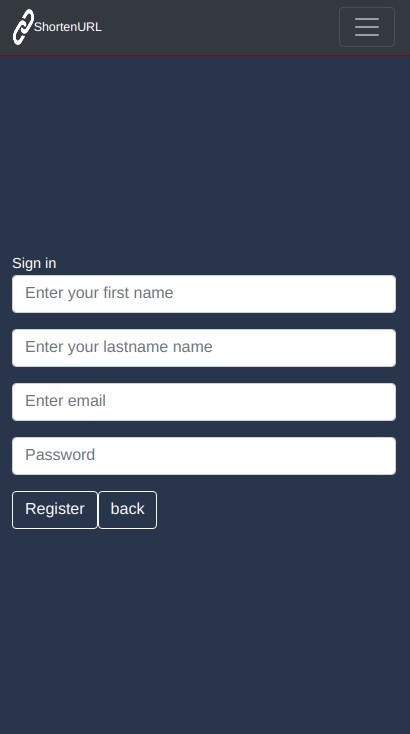
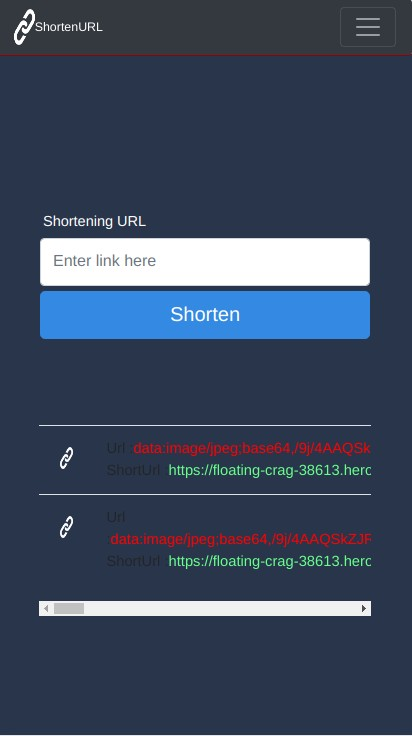

## ShortenURL (ReactJS + NodeJS)

A ShortenURL developed using React.Js as a Frontend tool, Node.Js as a Backend tool and for Data Base MongoDB is used.

A url shortener to reduce a long link. Use our tool to shorten links and then share them, in addition you can monitor traffic statistics.

The Project also works as a Progressive Web App and can be added to Home Screen of the Mobile App.

The Application is hosted at :[https://shorten-url-1.herokuapp.com/]

## Desktop view of application

## Mobile view of application

